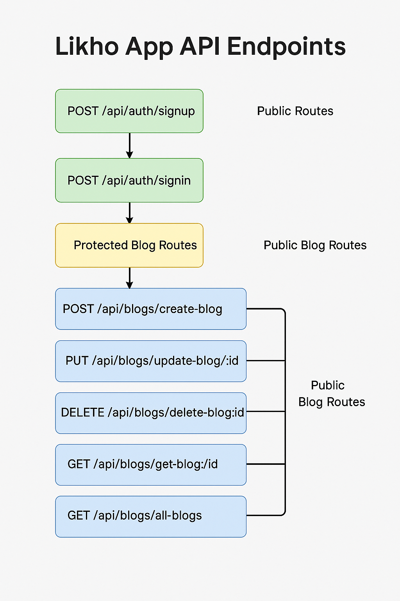

```
/server
├── /config
│   ├── db.js
│   ├── firebaseAuth.js
│   └── cloudinary.js
├── /controllers
│   ├── blogController.js
│   ├── authController.js
│   ├── commentController.js
│   └── ...
├── /middleware
│   ├── authMiddleware.js
│   ├── errorHandler.js
│   └── uploadMiddleware.js
├── /models
│   ├── User.js
│   ├── Blog.js
│   ├── Comment.js
│   └── ...
├── /routes
│   ├── authRoutes.js
│   ├── blogRoutes.js
│   ├── commentRoutes.js
│   └── ...
├── /services
│   ├── textToSpeech.js
│   ├── calendarApi.js
│   └── ...
├── /utils
│   ├── calculateReadTime.js
│   ├── generateSlug.js
│   └── ...
├── /uploads              👉 Local image upload (can be skipped if using Cloudinary)
├── server.js
```


# 📘 Likho App API Endpoints



## 🔓 Public Routes
- **POST** : `/api/auth/signup` – User SignUp  
- **POST** : `/api/auth/signin` – User SignIn  

## 🔐 Protected Blog Routes
- **POST** : `/api/blogs/create-blog` – Create Blog  
- **PUT** : `/api/blogs/update-blog/:id` – Update Blog  
- **DELETE** : `/api/blogs/delete-blog/:id` – Delete Blog  

## 📖 Public Blog Routes
- **GET** : `/api/blogs/get-blog/:id` – Get Blog by ID  
- **GET** : `/api/blogs/all-blogs` – Get All Blogs  
- **GET** : `/api/blogs/search?search=term&category=CategoryName` – Search/Filter Blogs  

---

> ✅ Make sure to send JWT token in `Authorization` header as `Bearer <token>` for protected routes.
